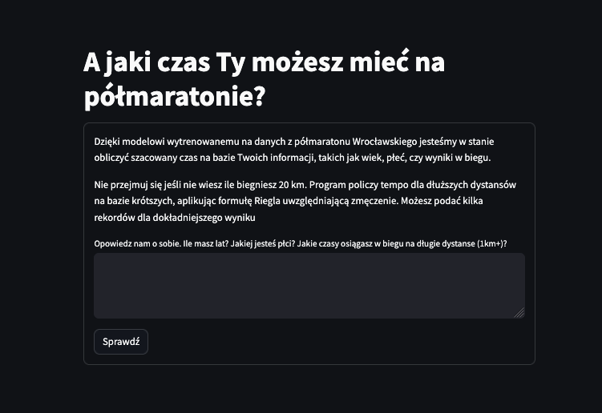
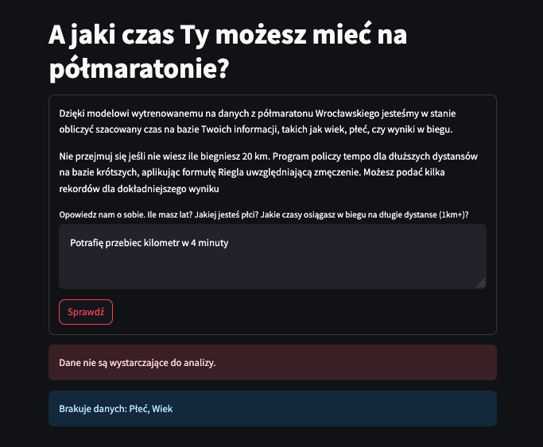
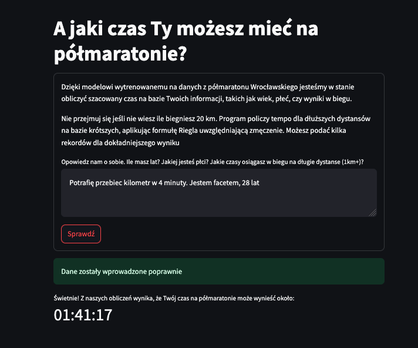

# Halfmarathon Time Predictor

An application implementing model trained on real data from halfmarathon in Wrocław. It parses user input to predict potential time on a long distance.
Application was created according to the instruction from a course hence the non-intuitive input method (text box).
The goal was to learn how to use cloud data service with online hosting (Digital Ocean) and LLM monitoring (Langfuse).

<a href="https://github.com/maciwid/halfmarathon_app" class="md-button md-button--primary">GitHub Repo</a>

### Screenshots:

<!-- <iframe
    id="content"
    src="iris.html"
    width="100%"
    style="border:1px solid black;overflow:hidden;"
></iframe> -->

