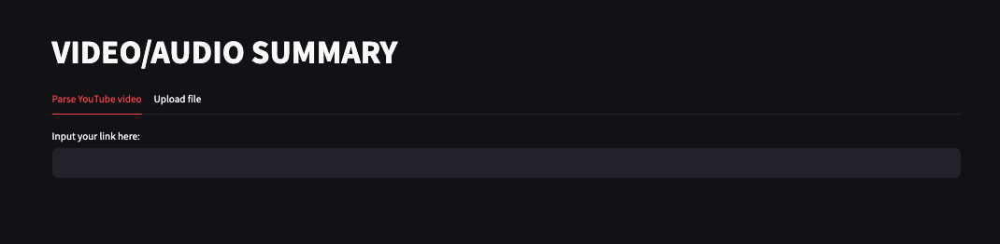
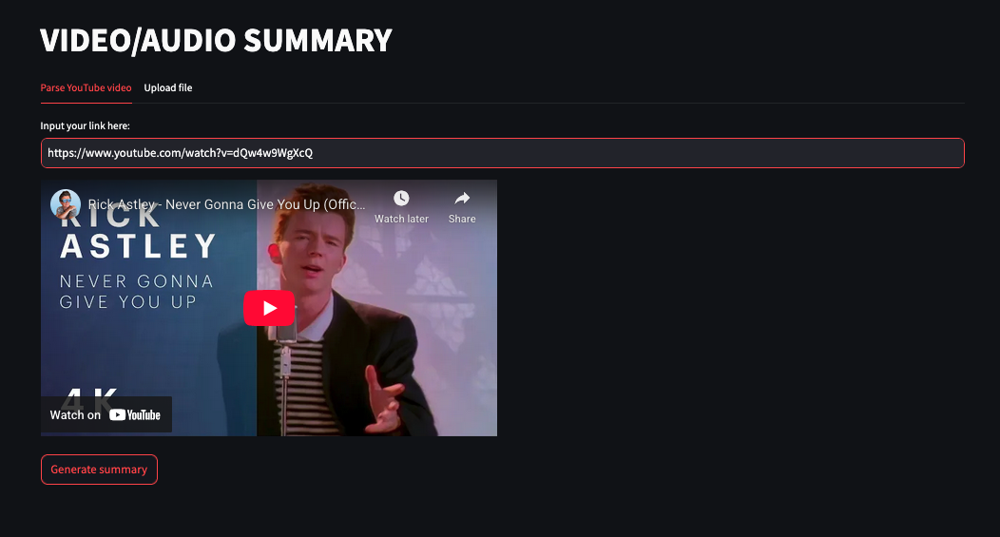
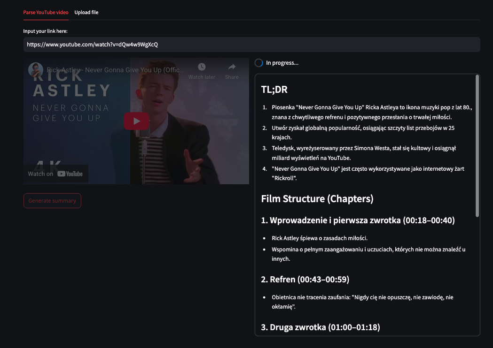
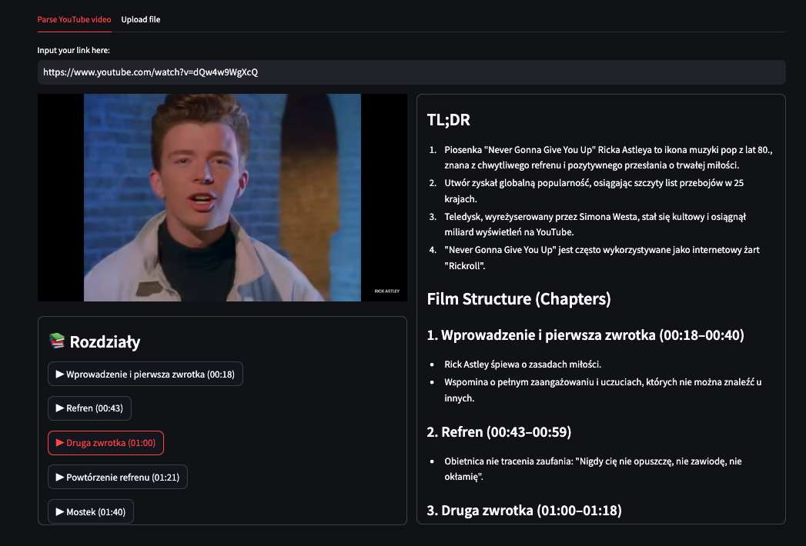

# Video/Audio Summarizer

A Streamlit-based application that creates concise summary of a video or audio. User can input a Youtube link or upload their own audio/video. 
Next, implementing LLM functionality a summary with timestamps is generated. User can directly jump to sections of an audio/video extracted by model using generated buttons.

The application is deployed on Streamlit Community Cloud. Due to YouTube API restrictions and IP-based limitations in cloud environments, automatic caption retrieval is currently blocked. As a workaround, users may upload a file manually or run the application locally.
 
<a href="https://github.com/maciwid/video_audio_summary" class="md-button md-button--primary">GitHub Repo</a>
<a href="https://videoaudiosummary-bi2nnfae5v9h7seam2qwag.streamlit.app/" class="md-button md-button--primary">Streamlit Community Cloud </a>

### Screenshots:

<!-- <iframe
    id="content"
    src="iris.html"
    width="100%"
    style="border:1px solid black;overflow:hidden;"
></iframe> -->

